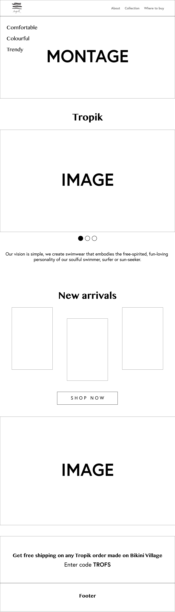
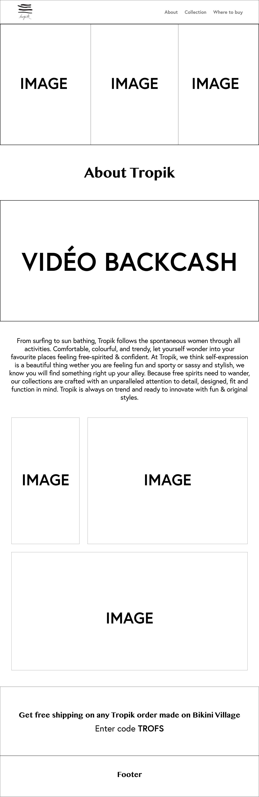
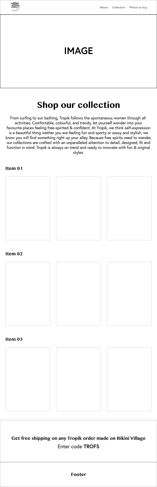

# Semaine 1   

## Mandat

### Description

#### Décrivez le projet ou les tâches que vous aurez à exécuter pendant votre stage. Quels mandats vous sont donnés? Quels logiciels et équipements devrez-vous utiliser? Soyez exhaustif.

Durant mon stage, je suis chargée de designer les courriels infolettres, faire du montage pour les vidéos Instagram ainsi que de designer les sites secondaire de la compagnie. De plus, je m'occupe également d'intégrer les infolettres envoyées aux clients. Pour la partie design, j'utilise principalement Adobe Photoshop et Adobe XD. Pour ce qui est du montage, j'utilise principalement Adobe After Effect. Enfin, j'utilise Salesforce pour l'intégration.

### Évaluation

#### Est-ce que le mandat vous semble réaliste selon le temps disponible pour votre stage? Expliquez pourquoi il l'est ou non. S'il ne l'est pas, assurez-vous d'en discuter avec votre maître de stage et votre enseignant superviseur. 

Je trouve mes tâches réalisables, car je ne suis pas submergée et je réussis à les finir avant l'échéance demandé.

## Les ressources nécessaires à la réalisation du projet

#### Faites une liste des ressources nécessaires (logiciels, équipements multimédia ou informatique) à la réalisation de vos tâches.

- Adobe Photoshop
- Adobe XD
- Adobe After Effect
- Salesforce
- Excel
- Word
- Clavier
- Souris
- Mac
- Écrans

### Matériel créatif disponible

#### Faites une liste du matériel créatif à votre disposition (design déjà créé, banque d'images ou de sons, banque de modèles de site web,...)

- Banque d'images de la compagnie (photos qui sont prises par la compagnie)
- Typographies de la suite Adobe
- Templates SquareSpace
- Template de base des infolettres

### Matériel créatif à réaliser

#### Faites une liste du matériel créatif que vous devez réaliser (Si applicable). Exemple: Visuel, sons, design,... 

- Design
- Visuel

### Matériel technique disponible

#### Faites une liste du matériel technique à votre disposition (installation wordpress déjà en place, caméra, serveurs, logiciels, site web déjà démarré, frameworks disponibles, librairies JavaScript, base de données,...)

Aucun

### Matériel technique à réaliser

#### Faites une liste du matériel technique que vous devez réaliser (Si applicable). Exemple: base de données, programmation...

Aucun

## Proposition créative

### Rappeler à l'employeur que ça existe: 

J’en ai parlé avec les entreprises lorsque j’ai confirmé les stages, il doit y avoir une place à ce que vous puissiez, en tant que stagiaire, faire une certaine proposition pour le projet sur lequel vous travaillez. Ce peut-être à plusieurs niveaux, que ce soit de la technique à utiliser, au niveau esthétique etc.  La proposition doit être faite formellement (dans un document Word, dans un wireframe, une maquette, un moodboard etc.) et remis à l’employeur (et, bien sûr, dans le journal de bord).  L’employeur pourra décider de l’accepter ou non, évidemment. Mais le stagiaire aura au moins eu l’opportunité de faire une proposition à un moment dans la planification du projet.    

Il sera important pour vous dès la première semaine de rappeler cet aspect avec votre employeur afin qu’il vous laisse cette ouverture pour faire une proposition dès la semaine 2 ou 3 max (l’évaluation de cet aspect se fait à la semaine 4 alors ça doit être fait avant). Votre prof superviseur vous le rappellera aussi.  

## Questions complémentaires

### Résumé de la semaine

#### Liste des tâches accomplies cette semaine

- Design des courriels infolettre
- Intégration des courriels infolettres
- Montage de vidéos promotionnelles à l'aide d'Adobe After Effect
- Création des bannières de réseaux sociaux à l'aide d'Adobe Photoshop
- Réalisation des maquettes filaires pour la proposition créative à l'aide d'Adobe XD
- Faire le moodboard ainsi que le fichier Word pour la proposition créative

Voilà un aperçu de ce que j'ai fait cette semaine :

> Design d'une des infolettres :

> Design d'une des bannières Facebook :

Aussi, voilà à quoi ressemble mes maquettes filaires :

> Maquette filaire de l'accueil :

> Maquette filaire de la page à propos :

> Maquette filaire de la page collection :

#### Liste des équipements ou logiciels utilisés

- Adobe Photoshop
- Adobe XD
- Adobe After Effect
- Salesforce
- Excel
- Word
- Clavier
- Souris
- Mac
- Écrans

#### Nouvelles choses apprises (méthode de travail, tâche, fonction d'un logiciel, équipement,...)

Je n'ai pas de nouvelles choses apprises vu que j'ai commencé mon travail en janvier.

#### Avez-vous accompli l'ensemble de vos tâches et objectifs pour la semaine? Décrivez  

- [X] Complètement 
- [ ] Assez
- [ ] Un peu
- [ ] Pas tout à fait
       
Description: À chaque semaine, je me fais une to-do list et j'ai réussi à la finir à temps.

#### Votre stage se déroule-t-il conformément au mandat initial? 

- [X] Oui
- [ ] Non    

####  Les objectifs à atteindre sont :  

- [X] Très clairement définis 
- [ ] Assez bien définis
- [ ] Quelque peu définis
- [ ] Plutôt vagues

####  Je bénéficie d'une supervision adéquate de mon maître de stage en entreprise:  

- [X] Très d'accord
- [ ] Assez d'accord
- [ ] Peu d'accord
- [ ] Pas d'accord
       
Commentaires: Tous les matins, ma superviseur fait un contrôle avec moi pour vérifier ma progression dans mes tâches pour savoir s'il m'en faut plus. 

####  Je dispose d'un espace de travail adéquat:  

- [X] Très d'accord
- [ ] Assez d'accord
- [ ] Peu d'accord
- [ ] Pas d'accord
  
Commentaires: J'ai accès à un bureau complet et bien équipé.

 ####  Je dispose d'outils de travail adéquat:  
 
- [X] Très d'accord
- [ ] Assez d'accord
- [ ] Peu d'accord
- [ ] Pas d'accord
  
Commentaires: J'ai accès à tous les logiciels dont j'ai besoin durant mon stage.

 ####  Je me sens bien intégré.e au personnel du service ou département où j’effectue mon stage.
 
- [ ] Très d'accord
- [ ] Assez d'accord
- [X] Peu d'accord
- [ ] Pas d'accord
           
Commentaires: J'ai encore un peu de misère à m'intégrer pour le moment.

### Mandat à réaliser

#### Je comprends l'entreprise dans laquelle j'effectue mon stage, les produits et services qu'elle offre ainsi que mon rôle dans cette dernière. 

- [X] Oui
- [ ] Non
       
Commentaires: Je connais l'entreprise étant donné que j'y travaille depuis près de deux ans. 

#### Le mandat à réaliser (projet ou tâches) est: 

- [X] Très clairement défini 
- [ ] Assez bien défini
- [ ] Quelque peu défini
- [ ] Plutôt vague
      
Commentaires: J'ai une liste de tâche qui m'est assignée et qui est très claire.

### Gestion du temps

#### J'évalue, planifie et organise mon travail. 

- [X] Très d'accord
- [ ] Assez d'accord
- [ ] Peu d'accord
- [ ] Pas d'accord
      
Commentaires: Je me fais une to-do liste à chaque semaine.
