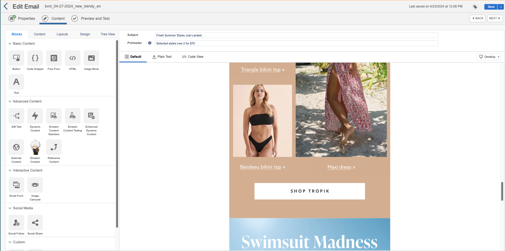

# Semaine 4

## Problèmes réels

#### Faites une liste des problèmes qui vous sont arrivés cette semaine. Pour chaque problème énuméré notez la solution que vous avez utilisée.

Je n'ai rencontré aucun problème cette semaine.

## Validation du travail

### Méthodes et outils de validation

#### Faites une liste des méthodes ou des outils que vous utilisez pour valider la qualité de votre travail.

- Vérification des critères demandés pour le projet
- Vérification que mon projet correspond aux critères
- Retravailler le projet si besoin

### Méthodes et outils de validation de l'employeur.se

#### Faites une liste des méthodes ou des outils que votre employeur utilise pour valider la qualité de votre travail.

- Laisser des commentaires sur Asana pour les détails à corriger
- Préciser que l'approbation est finale pour passer à la prochaine étape

### Critères pour valider la qualité de votre travail

- Qualité
- Respect des consignes demandées

#### Faites une liste des critères à valider pour vous assurer que votre travail est bien fait. 

- Respecte les consignes demandées
- Travail de qualité

### Traces du processus de validation

#### Insérez des images de votre processus de validation (Liste cochée, grille de validation, résultat de tests, capture d'écran de commentaires, prise de notes,...) Ajoutez les dates associées aux images.

> 22 avril :

> 22 avril :

> 23 avril :

## Questions complémentaires

### Résumé de la semaine

#### Liste des tâches accomplies cette semaine

- Montage vidéo sur Adobe Photoshop pour la nouvelle collection Tropik
- Intégration des courriels infolettres
- Design des courriels infolettres
- Commencer les maquettes filaires en nouvelles versions
- Refaire le moodboard

> Nouveau moodboard :

> Design des infolettres sur Photoshop :

Voilà un aperçu de ce que j'ai fait cette semaine :

> Processus de visualisation des storys sur Adobe Photoshop :

> Processus de montage sur Adobe Photoshop :

> Processus d'intégration des infolettres :

#### Liste des équipements ou logiciels utilisés

- Adobe Photoshop
- Adobe XD
- Adobe After Effect
- Salesforce
- Excel
- Word
- Clavier
- Souris
- Mac
- Écrans

#### Faits saillants de la semaine

J'ai commencé à travailler sur les nouvelles maquettes pour le site web.

#### Nouvelles choses apprises (méthode de travail, tâche, fonction d'un logiciel, équipement,...)

Je n'ai pas vraiment appris quelque chose de nouveau cette semaine.

#### Avez-vous accompli l'ensemble de vos tâches et objectifs pour la semaine? Décrivez 

- [X] Complètement 
- [ ] Assez
- [ ] Un peu
- [ ] Pas tout à fait    

#### Est-ce que votre mandat ou vos tâches se réalisent selon l'échéancier prévu?

- [X] Complètement 
- [ ] Assez
- [ ] Un peu
- [ ] Pas tout à fait    

### La dynamique du stage

#### Je suis satisfait de mon stage jusqu'à maintenant.

- [X] Complètement 
- [ ] Assez
- [ ] Un peu
- [ ] Pas tout à fait
         
Commentaires: J'aime les tâches qui me sont assignées.

#### J'éprouve des difficultés:

- [ ] Souvent
- [ ] Régulièrement
- [ ] Parfois
- [X] Rarement

### Qualité et validation du travail accompli

#### Je porte une attention aux détails dans la réalisation de mes tâches.

- [X] Très d'accord
- [ ] Assez d'accord
- [ ] Peu d'accord
- [ ] Pas d'accord
       
Commentaires: Je m'assure de respecter tout ce qui est demandé de moi.

#### J'utilise des méthodes de sauvegarde efficaces de mon travail:

- [X] Très d'accord
- [ ] Assez d'accord
- [ ] Peu d'accord
- [ ] Pas d'accord
        
Commentaires: Mes dossiers sont bien classés et sont clairs à comprendre.    

#### Je propose des solutions appropriées aux problèmes rencontrés: 

- [ ] Très d'accord
- [X] Assez d'accord
- [ ] Peu d'accord
- [ ] Pas d'accord
         
Commentaires: Je n'ai pas souvent l'occasion de le faire, mais lorsqu'un problème arrive, j'essaye de le régler.

### Compétences techniques

#### Je crée du contenu (code, visuel, son,...) de qualité ou j'optimise judicieusement le contenu existant:

- [X] Très d'accord
- [ ] Assez d'accord
- [ ] Peu d'accord
- [ ] Pas d'accord
- [ ] Ne s'applique pas
           
Commentaires: Je m'assure toujours d'offrir un travail qualitatif en utilisant les ressources offertes.    

#### J'apprivoise aisément un nouveau logiciel ou un nouvel équipement:

- [X] Très d'accord
- [ ] Assez d'accord
- [ ] Peu d'accord
- [ ] Pas d'accord
          
Commentaires: J'apprends à découvrir Adobe Photoshop sous un nouvel angle avec l'option de montage.

#### J'utilise de façon optimale les ressources matérielles et informationnelles mises à ma disposition:

- [X] Très d'accord
- [ ] Assez d'accord
- [ ] Peu d'accord
- [ ] Pas d'accord
- [ ] Ne s'applique pas
          
Commentaires: Je fais toujours de mon mieux pour utiliser les outils qui sont mis à ma dispotion de manière optimale.

### Sens des responsabilités

#### Je démontre qu'on peut me confier une tâche sans inquiétude:

- [X] Très d'accord
- [ ] Assez d'accord
- [ ] Peu d'accord
- [ ] Pas d'accord   

#### Je suis débrouillard.e et je fais preuve d'autonomie:

- [X] Très d'accord
- [ ] Assez d'accord
- [ ] Peu d'accord
- [ ] Pas d'accord

#### Je vérifie mon travail et m'assure qu'il est bien accompli:

- [X] Très d'accord
- [ ] Assez d'accord
- [ ] Peu d'accord
- [ ] Pas d'accord

#### Je suis assidu.e et ponctuel.le:

- [X] Très d'accord
- [ ] Assez d'accord
- [ ] Peu d'accord
- [ ] Pas d'accord

#### Je respecte les tâches et les mandats confiés:

- [X] Très d'accord
- [ ] Assez d'accord
- [ ] Peu d'accord
- [ ] Pas d'accord
      
Commentaires: Je m'assure de remettre mes projets à temps en n'oubliant aucune consignes.  

### Capacité d'adaptation

#### Je sais m'ajuster devant un imprévu:

- [X] Très d'accord
- [ ] Assez d'accord
- [ ] Peu d'accord
- [ ] Pas d'accord
         
Commentaires: Lorsque je dois recommencer une tâche parce que les consignes changent entre temps, je le prends bien et recommence sans problème.  

#### J'accepte de réaliser de nouvelles tâches (Soit des tâches qui n'étaient pas prévues ou des tâches que vous n'avez jamais eu à faire):

- [X] Très d'accord
- [ ] Assez d'accord
- [ ] Peu d'accord
- [ ] Pas d'accord
         
Commentaires: J'accepte toutes les tâches qui me sont données pour aider le plus possible, même si ça implique d'apprendre de zéro comment faire ou même si la tâche ne correspond pas à mon domaine.

