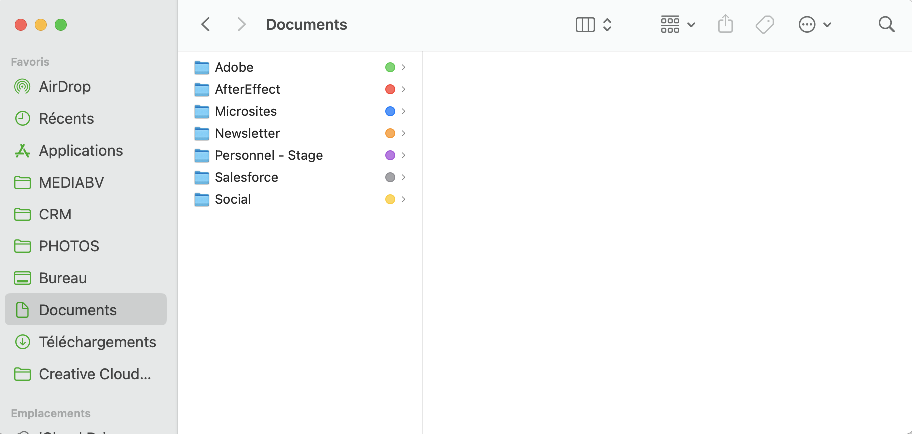
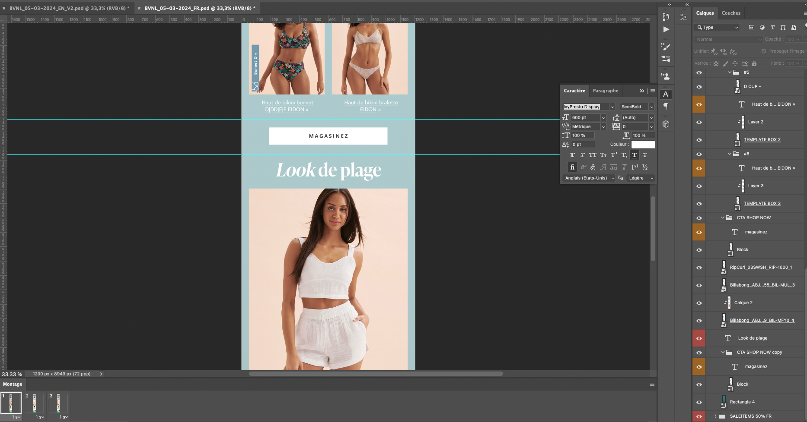
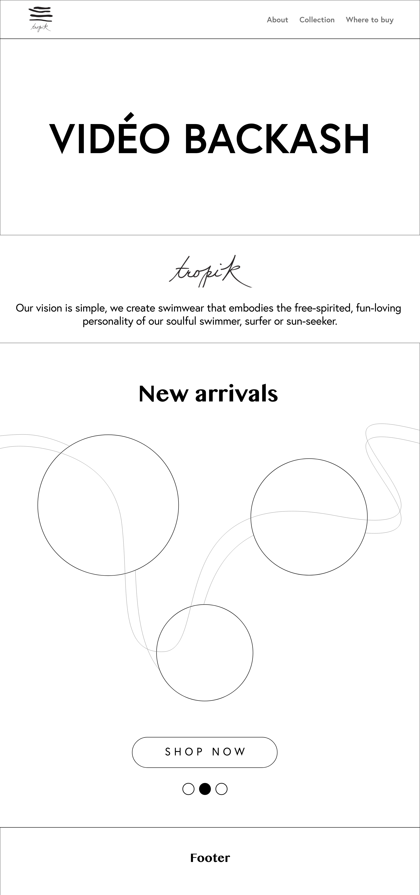

# Semaine 5

## Problèmes réels

#### Faites une liste des problèmes qui vous sont arrivés cette semaine. Pour chaque problème énuméré notez la solution que vous avez utilisée.

Je n'ai rencontré aucun problème cette semaine.

## Sauvegarde et archivage

### Méthodes de sauvegarde

#### Faites une liste des méthodes que vous utilisez pour sauvegarder votre travail. Prévoyez-vous des copies de sécurité? 

- Je divise mes fichiers dans les différents dossiers que je crée
- Je les renomme correctement selon les versions
- Je me garde un backup en ligne et local

### Méthodes d'archivage

#### Faites une liste des méthodes que vous utilisez pour archiver les documents importants dont vous n'avez plus besoin.

- Je les classe dans les dossiers qui leur correspondent le mieux
- Je rajoute le "__OLD" pour m'en souvenir

### Méthodes d'archivage finale

#### Décrivez de quelle façon vous remettrez vos fichiers finaux à l'employeur. De quelle façon vous assurerez vous que tous les fichiers seront bien archivés? Produirez-vous de la documentation avec des explications? 

Je remet mes fichiers dans les dossiers du serveur qui leur correspondent (ex : les fichiers PSD dans les dossiers Création) et je m'assure de les nommer comme il faut. Je n'ai pas besoin de produire de la documentation

### Traces du processus de sauvegarde

#### Insérez des images du classement de vos sauvegardes (Capture écran du classement de vos fichiers).

> Organisation de mes documents :

> Organisation de mes infolettres :

> Organisation de mes microsites :

## Questions complémentaires

### Résumé de la semaine

#### Liste des tâches accomplies cette semaine

- Design des courriels infolettres
- Intégration des courriels infolettres
- Finalisation des maquettes filaires
- Trouver la nouvelle palette de couleurs du site web
- Trouver la typographie
- Faire les maquettes graphiques
- Mettre à jour les microsites (bannières, images secondaires, collection)

> Design des infolettres sur Photoshop :

Aussi, voici l'avancement de mes maquettes filaires :

> Home page maquette filaire :

> Slider 01 maquette filaire :

> Slider 02 maquette filaire :

> Pop up maquette filaire :

> À propos maquette filaire :

> Collection maquette filaire :

> Where to buy maquette filaire :

Et voici l'avancement de mes maquettes graphiques :

> Home page maquette graphique :

> Slider 01 maquette graphique :

> Slider 02 maquette graphique :

> Pop up maquette graphique :

> À propos maquette graphique :

> Collection maquette graphique :

> Where to buy maquette graphique :

#### Liste des équipements ou logiciels utilisés

- Adobe Photoshop
- Adobe XD
- Adobe After Effect
- Salesforce
- Excel
- Word
- Clavier
- Souris
- Mac
- Écrans

#### Faits saillants de la semaine

Il ne s'est pas passé grand chose de spécial cette semaine.

#### Nouvelles choses apprises (méthode de travail, tâche, fonction d'un logiciel, équipement,...)

J'ai appris comment céduler les infolettres sur SalesForce

#### Avez-vous accompli l'ensemble de vos tâches et objectifs pour la semaine? Décrivez 

- [X] Complètement 
- [ ] Assez
- [ ] Un peu
- [ ] Pas tout à fait    

#### Est-ce que votre mandat ou vos tâches se réalisent selon l'échéancier prévu?    

- [X] Complètement 
- [ ] Assez
- [ ] Un peu
- [ ] Pas tout à fait    

### La dynamique du stage

#### Je suis satisfait de mon stage jusqu'à maintenant.

- [X] Complètement 
- [ ] Assez
- [ ] Un peu
- [ ] Pas tout à fait
          
Commentaires: Je progresse énormément grâce à mon stage et j'en suis satisfaite

#### Mon maître de stage en entreprise est présent:

- [X] En tout temps 
- [ ] Régulièrement
- [ ] Parfois
- [ ] Rarement
          
Commentaires: Mon maître de stage est toujours présent pour m'aider et me répondre

#### J'ose poser des questions:

- [X] En tout temps 
- [ ] Régulièrement
- [ ] Parfois
- [ ] Rarement
          
Commentaires: Je ne suis pas gênée de poser des questions   

#### Je ressens du stress: 

- [ ] Souvent
- [ ] Régulièrement
- [X] Parfois
- [ ] Rarement
          
Commentaires: Avez-vous des méthodes pour gérer votre stress? Comment pourrait-il être diminué?

Généralement, je pars prendre une petite marche dans le bureau pour me calmer

#### J'éprouve des difficultés:

- [ ] Souvent
- [ ] Régulièrement
- [ ] Parfois
- [X] Rarement

### Qualité et validation du travail accompli

#### J'utilise des méthodes de validation efficaces avec l'employeur.se pour m'assurer de la qualité du travail accompli.

- [X] Très d'accord
- [ ] Assez d'accord
- [ ] Peu d'accord
- [ ] Pas d'accord
        
Commentaires: Mon travail est toujours mis pour approbation avant d´être utilisé

#### Je propose des solutions appropriées aux problèmes rencontrés: 

- [ ] Très d'accord
- [ ] Assez d'accord
- [X] Peu d'accord
- [ ] Pas d'accord
      
Commentaires: Je n'ai pas vraiment l'occasion de le faire

#### J'utilise des méthodes de sauvegarde efficaces de mon travail.

- [X] Très d'accord
- [ ] Assez d'accord
- [ ] Peu d'accord
- [ ] Pas d'accord
      
Commentaires: Mes fichiers sont très bien classés

### Compétences techniques

#### Je crée du contenu (code, visuel, son,...) de qualité ou j'optimise judicieusement le contenu existant:

- [ ] Très d'accord
- [ ] Assez d'accord
- [ ] Peu d'accord
- [ ] Pas d'accord
- [X] Ne s'applique pas      

#### Je suis en mesure d'utiliser les logiciels ou outils mis à ma disposition:

- [X] Très d'accord
- [ ] Assez d'accord
- [ ] Peu d'accord
- [ ] Pas d'accord
        
Commentaires: Les outils sont assez intuitifs et faciles à utiliser   

#### J'utilise de façon optimale les ressources matérielles et informationnelles mises à ma disposition:

- [ ] Très d'accord
- [ ] Assez d'accord
- [ ] Peu d'accord
- [ ] Pas d'accord
- [X] Ne s'applique pas

### Qualité du produit

#### Je réalise un produit cohérent avec le concept et le mandat initial:

- [X] Très d'accord
- [ ] Assez d'accord
- [ ] Peu d'accord
- [ ] Pas d'accord
- [ ] Ne s'applique pas  

#### J'offre une proposition artistique inventive et recherchée. (Si vous avez à faire des proposition artistiques)

- [X] Très d'accord
- [ ] Assez d'accord
- [ ] Peu d'accord
- [ ] Pas d'accord
- [ ] Ne s'applique pas

### Gestion du temps

#### J'évalue, planifie et organise mon travail.

- [X] Très d'accord
- [ ] Assez d'accord
- [ ] Peu d'accord
- [ ] Pas d'accord     

#### Je démontre de l'initiative pour utiliser mon temps efficacement.

- [X] Très d'accord
- [ ] Assez d'accord
- [ ] Peu d'accord
- [ ] Pas d'accord

#### Je respecte les échéanciers et m'acquitte des tâches avec efficacité:

- [X] Très d'accord
- [ ] Assez d'accord
- [ ] Peu d'accord
- [ ] Pas d'accord
              
Commentaires: Je m'assure toujours de finir mes tâches à temps

### Capacité d'adaptation

#### J'accepte les critiques constructives et j'apporte les correctifs demandés: 

- [X] Très d'accord
- [ ] Assez d'accord
- [ ] Peu d'accord
- [ ] Pas d'accord
      
Commentaires: Je suis ouverte à la critique pour m'améliorer

#### Je sais m'ajuster devant un imprévu:

- [X] Très d'accord
- [ ] Assez d'accord
- [ ] Peu d'accord
- [ ] Pas d'accord
      
Commentaires: J'ai souvent dû m'ajuster à des changements de dernière minute et le fait sans problème  

#### J'expérimente et j'apprends de nouvelles notions grâce aux connaissances déjà acquises.

- [X] Très d'accord
- [ ] Assez d'accord
- [ ] Peu d'accord
- [ ] Pas d'accord
- [ ] Ne s'applique pas
      
Commentaires: J'apprends un peu plus tous les jours comment utiliser différemment la suite Adobe
