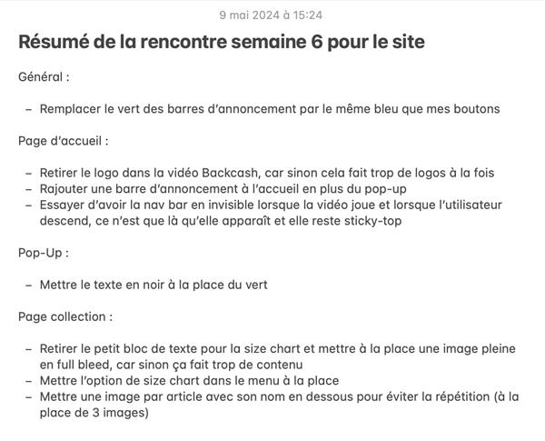

# Semaine 6

## Problèmes réels

#### Faites une liste des problèmes qui vous sont arrivés cette semaine. Pour chaque problème énuméré notez la solution que vous avez utilisée.

Je n'ai rencontré aucun problème cette semaine.

## Le produit

#### Si tu as réalisé un ou des projets pendant ton stage qui t'amenait à produire quelque chose, insère un lien permettant de voir la version préliminaire du ou des produits. Tu peux aussi insérer des photos ou vidéos de ton travail!

https://www.tropikswimwear.com (non fini, sera fini à la semaine 7)

## Questions complémentaires

### Résumé de la semaine

#### Liste des tâches accomplies cette semaine

- Design des courriels infolettres
- Montage de storys Instagram sur Adobe Photoshop

> Processus de création des storys :

- Intégration de courriels infolettres
- Commencer l'intégration en temps réel sur le site
- Meeting pour la proposition finale

> Points importants du meeting :

> Début de l'intégration :

#### Liste des équipements ou logiciels utilisés

- Adobe Photoshop
- Adobe XD
- Adobe After Effect
- Salesforce
- Excel
- Word
- Clavier
- Souris
- Mac
- Écrans

#### Faits saillants de la semaine

J'ai eu mon deuxième meeting pour ma proposition créative

#### Nouvelles choses apprises (méthode de travail, tâche, fonction d'un logiciel, équipement,...)

J'ai appris comment coder dans SquareSpace

#### Avez-vous accompli l'ensemble de vos tâches et objectifs pour la semaine? Décrivez

- [X] Complètement 
- [ ] Assez
- [ ] Un peu
- [ ] Pas tout à fait

#### Est-ce que votre mandat ou vos tâches se réalisent selon l'échéancier prévu?

- [X] Complètement 
- [ ] Assez
- [ ] Un peu
- [ ] Pas tout à fait
         
### La dynamique du stage

#### Mon degré d'apprentissage grâce à ce stage est:

- [ ] Très élevé
- [X] Élevé
- [ ] Acceptable
- [ ] Insuffisant
         
Commentaires: J'apprends toujours des nouvelles petites techniques au fur et à mesure

####  Je me sens bien intégré.e au personnel du service ou département de mon stage.

- [ ] Très d'accord
- [X] Assez d'accord
- [ ] Peu d'accord
- [ ] Pas d'accord
  
Commentaires: Je m'entends bien avec tout le monde

#### Je suis satisfait de mon stage jusqu'à maintenant. 

- [X] Complètement 
- [ ] Assez
- [ ] Un peu
- [ ] Pas tout à fait
         
Commentaires: Mon stage correspond à mes attentes

### Qualité et validation du travail accompli

#### Je porte une attention aux détails dans la réalisation de mes tâches.

- [X] Très d'accord
- [ ] Assez d'accord
- [ ] Peu d'accord
- [ ] Pas d'accord
       
Commentaires: Je fais toujours attention à donner un travail de qualité

#### Je propose des solutions appropriées aux problèmes rencontrés:

- [X] Très d'accord
- [ ] Assez d'accord
- [ ] Peu d'accord
- [ ] Pas d'accord
       
Commentaires: Je m'exprime un peu plus lorsque ça concerne mes projets

### Qualité du produit

#### Je réalise un produit cohérent avec le concept et le mandat initial:

- [X] Très d'accord
- [ ] Assez d'accord
- [ ] Peu d'accord
- [ ] Pas d'accord
- [ ] Ne s'applique pas  

#### Je développe une navigation ou une interactivité conviviale et fluide.

- [X] Très d'accord
- [ ] Assez d'accord
- [ ] Peu d'accord
- [ ] Pas d'accord
- [ ] Ne s'applique pas

#### Je réalise un produit achevé d'une valeur esthétique réussie. 

- [X] Très d'accord
- [ ] Assez d'accord
- [ ] Peu d'accord
- [ ] Pas d'accord
- [ ] Ne s'applique pas

#### J'offre une proposition artistique inventive et recherchée. (Si vous avez à faire des proposition artistiques)

- [X] Très d'accord
- [ ] Assez d'accord
- [ ] Peu d'accord
- [ ] Pas d'accord
- [ ] Ne s'applique pas

### Sens des responsabilités

#### Je démontre qu'on peut me confier une tâche sans inquiétude:

- [X] Très d'accord
- [ ] Assez d'accord
- [ ] Peu d'accord
- [ ] Pas d'accord   

#### Je respecte les tâches et les mandats confiés:

- [X] Très d'accord
- [ ] Assez d'accord
- [ ] Peu d'accord
- [ ] Pas d'accord
          
Commentaires: J'accomplis toutes les tâches qui me sont demandées    

### Travail d'équipe

#### Je travaille en collaboration avec l'équipe.

- [X] Très d'accord
- [ ] Assez d'accord
- [ ] Peu d'accord
- [ ] Pas d'accord
- [ ] Ne s'applique pas   

#### J'apporte ma contribution à l'entreprise et je fais avancer le travail par mes suggestions.

- [ ] Très d'accord
- [X] Assez d'accord
- [ ] Peu d'accord
- [ ] Pas d'accord   

#### Je reconnais et profite de l'expertise des autres membres de l'équipe.

- [X] Très d'accord
- [ ] Assez d'accord
- [ ] Peu d'accord
- [ ] Pas d'accord
- [ ] Ne s'applique pas
       
Commentaires: Je profite de l'expérience du designer autant que je peux
