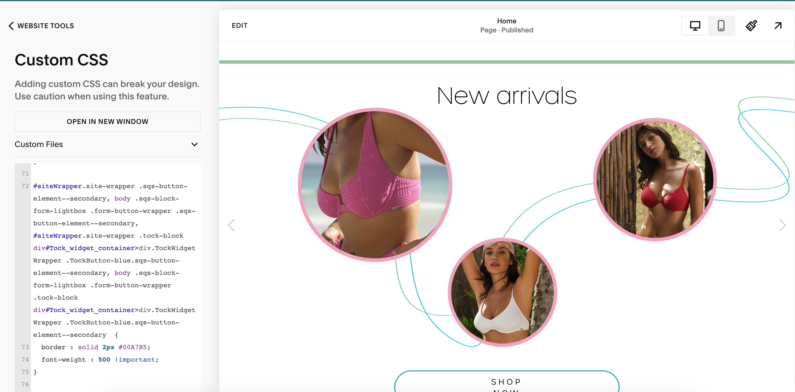

# Semaine 7
## Le produit
#### Si tu as réalisé un ou des projets pendant ton stage qui t'amenait à produire quelque chose, insère un lien permettant de voir la version finale du ou des produits. Tu peux aussi insérer des photos ou vidéos de ton travail!

> Premiers tests :

> Premières lignes de code :

Résultat final : https://www.tropikswimwear.com/

## Questions complémentaires

### Résumé de la semaine

#### Liste des tâches accomplies cette semaine

- Intégration des courriels infolettres
- Finalisation du visuel site web Tropik
- Programmation de quelques aspects sur le site

#### Liste des équipements ou logiciels utilisés

- Adobe Photoshop
- Adobe XD
- Adobe After Effect
- Salesforce
- Excel
- Word
- Clavier
- Souris
- Mac
- Écrans

#### Faits saillants de la semaine

Il ne s'est rien passé d'intéressant cette semaine.

#### Nouvelles choses apprises (méthode de travail, tâche, fonction d'un logiciel, équipement,...)

Je suis un peu plus à l'aise pour programmer sur l'interface SquareSpace

#### Avez-vous accompli l'ensemble de vos tâches et objectifs pour la semaine? Décrivez

- [X] Complètement 
- [ ] Assez
- [ ] Un peu
- [ ] Pas tout à fait

#### Est-ce que votre mandat ou vos tâches ont été réalisés selon l'échéancier prévu?    

- [X] Complètement 
- [ ] Assez
- [ ] Un peu
- [ ] Pas tout à fait

#### Je suis satisfait de mon stage. 

- [X] Complètement 
- [ ] Assez
- [ ] Un peu
- [ ] Pas tout à fait
      
Commentaires: J'ai vraiment progressé durant ce stage et j'en suis satisfaite

## Autoévaluation finale

#### Ce milieu de travail a répondu à mes attentes initiales:

- [ ] Entièrement
- [X] Plutôt bien
- [ ] Partiellement
- [ ] Pas tout à fait
          
Justifications: Le stage correspondait au mandat qui m'avait été proposé initialement. J'ai pu apprendre beaucoup de techniques que je ne savais pas maitriser et j'ai évolué. Ce stage m'as permis de devenir encore plus multitâche vu que je faisais un peu de tout. Le seul point négatif était que je n'avais pas beaucoup d'opportunité d'exprimer ma créativité dans le design mise-à-part sur mon projet final.

### Sens des responsabilités

#### J'ai démontré qu'on pouvait me confier une tâche sans inquiétude.

- [X] Très d'accord
- [ ] Assez d'accord
- [ ] Peu d'accord
- [ ] Pas d'accord   

#### J'étais débrouillard.e et je faisais preuve d'autonomie.

- [X] Très d'accord
- [ ] Assez d'accord
- [ ] Peu d'accord
- [ ] Pas d'accord

#### Je vérifiais mon travail et m'assurait qu'il était bien accompli.

- [X] Très d'accord
- [ ] Assez d'accord
- [ ] Peu d'accord
- [ ] Pas d'accord

#### J'étais assidu.e et ponctuel.le.

- [X] Très d'accord
- [ ] Assez d'accord
- [ ] Peu d'accord
- [ ] Pas d'accord

#### Je respectais mon horaire de travail.

- [X] Très d'accord
- [ ] Assez d'accord
- [ ] Peu d'accord
- [ ] Pas d'accord

#### Je respectais les tâches et les mandats confiés.

- [X] Très d'accord
- [ ] Assez d'accord
- [ ] Peu d'accord
- [ ] Pas d'accord    

#### Commentaires sur le sens des responsabilités: 

Je considère que j'ai été responsable durant ce stage, car je remplissais toutes mes tâches correctement et dans le délai demandé. Je m'assurais d'être toujours à l'heure le plus possible et de respecter ce qui était demandé de moi. De plus, je me suis bien organisée à l'aide de mes to-do lists et de mes prises de notes.

### Gestion du temps

#### J'évaluais, planifiais et organisais bien mon travail.

- [X] Très d'accord
- [ ] Assez d'accord
- [ ] Peu d'accord
- [ ] Pas d'accord   

#### Je démontrais de l'initiative pour utiliser mon temps efficacement.

- [X] Très d'accord
- [ ] Assez d'accord
- [ ] Peu d'accord
- [ ] Pas d'accord

#### Je respectais mes échéanciers et m'acquittais de mes tâches avec efficacité.

- [X] Très d'accord
- [ ] Assez d'accord
- [ ] Peu d'accord
- [ ] Pas d'accord

#### Commentaires sur votre gestion du temps:   

Je ne dépasse jamais l'échéance demandée et m'assure de faire les choses dans le bon ordre

### Capacité d'adaptation

#### J'acceptais les critiques constructives et apportais les correctifs demandés.

- [X] Très d'accord
- [ ] Assez d'accord
- [ ] Peu d'accord
- [ ] Pas d'accord   

#### Je m'adaptais à la méthode de travail et aux outils utilisés.

- [X] Très d'accord
- [ ] Assez d'accord
- [ ] Peu d'accord
- [ ] Pas d'accord

#### Je savais m'ajuster devant un imprévu.

- [X] Très d'accord
- [ ] Assez d'accord
- [ ] Peu d'accord
- [ ] Pas d'accord

#### J'acceptais de réaliser une nouvelle tâche.

- [X] Très d'accord
- [ ] Assez d'accord
- [ ] Peu d'accord
- [ ] Pas d'accord

#### J'expérimentais et apprenais de nouvelles notions grâce aux connaissances déjà acquises. 

- [X] Très d'accord
- [ ] Assez d'accord
- [ ] Peu d'accord
- [ ] Pas d'accord

#### Commentaires sur votre capacité d'adaptation:   

J'ai dû à plusieurs reprises prendre des tâches qui m'étaient nouvelles ou apprendre par moi-même des notions à l'aide de Youtube ou autres. Je m'adapte bien à chaque nouveau défi et je réussis à le surpasser.

### Travail d'équipe

#### Je travaillais en collaboration avec l'équipe.

- [X] Très d'accord
- [ ] Assez d'accord
- [ ] Peu d'accord
- [ ] Pas d'accord
- [ ] Ne s'applique pas

#### J'apportais ma contribution à l'entreprise et faisais avancer le travail par mes suggestions.

- [ ] Très d'accord
- [X] Assez d'accord
- [ ] Peu d'accord
- [ ] Pas d'accord

#### Je reconnaissais et profitais de l'expertise des autres membres de l'équipe ou de mon superviseur de stage.

- [X] Très d'accord
- [ ] Assez d'accord
- [ ] Peu d'accord
- [ ] Pas d'accord
- [ ] Ne s'applique pas

#### Commentaires sur le travail d'équipe:   

Je travaille bien en équipe et n'a aucun problème à prendre plus de charge de travail ou en déléguer.

### Relations interpersonnelles

#### J'établissais facilement des contacts avec les gens.

- [ ] Très d'accord
- [X] Assez d'accord
- [ ] Peu d'accord
- [ ] Pas d'accord
- [ ] Ne s'applique pas

#### Je savais écouter et considérer l'opinion des autres.

- [X] Très d'accord
- [ ] Assez d'accord
- [ ] Peu d'accord
- [ ] Pas d'accord
- [ ] Ne s'applique pas

#### Je savais faire preuve de discrétion

- [X] Très d'accord
- [ ] Assez d'accord
- [ ] Peu d'accord
- [ ] Pas d'accord

#### Je me montrais courtois.e.

- [X] Très d'accord
- [ ] Assez d'accord
- [ ] Peu d'accord
- [ ] Pas d'accord

#### Je m'adaptais bien à la culture de l'entreprise et aux attentes de l'employeur.se.

- [X] Très d'accord
- [ ] Assez d'accord
- [ ] Peu d'accord
- [ ] Pas d'accord

#### Commentaires sur les relations interpersonnelles:   

Je ne me suis pas lié d'amitié avec mes collègues, car je ne les connais pas assez, mais je suis un peu plus à l'aise avec eux.

### Habiletés et compétences développées

#### Qu'avez-vous découvert par ce stage? 

Durant ce stage, j'ai découvert comment intégrer des courriels sur SquareSpace. De plus, j'ai appris comment faire du montage vidéo sur Photoshop et tout plein de petite astuces pour designer sur Photoshop efficacement. Enfin, j'ai également appris à programmer sur SquareSpace.

#### Ce stage a contribué à augmenter la confiance en mes compétences de façon:

- [ ] Très significative
- [X] Significative
- [ ] Acceptable
- [ ] Insuffisante

#### J'estime que ce stage m'a permis de développer mes relations professionnelles de façon:

- [X] Très significative
- [ ] Significative
- [ ] Acceptable
- [ ] Insuffisante

#### Avez-vous accompli le mandat qui était convenu avec l'entreprise? 

- [X] Oui
- [ ] Non

#### Quelles ont été vos plus grandes forces dans le travail effectué durant le stage? 

Mes plus grandes forces sont ma capacité à m'adapter à toutes les situations changeantes ainsi que ma polyvalence. En effet, il n'est pas rare qu'un design doit être refait ou modifié du jour au lendemain à cause d'un changement de dernière minute et j'y réagissais très rapidement pour le corriger. Aussi, quant à ma polyvalence, je pouvais toucher à tout et réussir à réaliser ce qui était demandé.

#### Qu'avez-vous trouvé le plus difficile à réaliser?

Je n'ai pas trouvé un projet particulièrement difficile

#### Sur une échelle de 1 à 10, quelle évaluation faites-vous de votre travail dans l'entreprise d'accueil? (1: insuffisant, 10: Exceptionnel)

8

#### Que devez-vous améliorer dans votre pratique professionnelle? 

Selon moi, je devrais améliorer le fait d'être moins timide pour engager plus d'interactions sociales

#### Comment vous y prendre pour vous améliorer? 

Essayer de faire le premier pas plus souvent et me prendre moins la tête

#### Dans quelles proportions vos décisions profesionnelles futures seront-elles influencées par cette expérience de stage? 

- [X] Beaucoup
- [ ] Raisonnablement
- [ ] Partiellement
- [ ] Peu

#### Globalement comment qualifieriez-vous votre expérience de stage? 

- [X] Très satisfaisante
- [ ] Satisfaisante
- [ ] Partiellement satisfaisante
- [ ] Insatisfaisante

#### Recommanderiez-vous ce lieu de stage à un futur stagiaire? 

- [X] Oui
- [ ] Non
      
Pourquoi? 

Ce stage touchait à plein du domaine du multimédia, donc il est difficile de s'ennuyer parce que les projets à faire ne sont pas pareils les jours

#### Commentaires généraux sur le stage:   

Je me suis amusée durant mon stage !
