# Consignes pour la présentation orale finale

La présentation aura lieu le 22 mai de 10h à 16h.     

Vous devez avoir un support visuel pour votre présentation (Google slide, powerpoint, canvas, ...)    
Insérez des images de votre projet et de vos tâches, ce sera plus dynamique!   

Durée: 7 à 10 minutes    

Insérez ici votre powerpoint ou lien vers votre documentation!

## Contextualiser: Décrire votre mandat de stage, ce que vous avez réalisé comme projet ou tâches et les aspects techniques généraux.

Durant mon mandat à Bikini Village, j’ai été initialement engagé comme stagiaire en design graphique, mais également en tant qu’intégratrice des courriels infolettres. Pour ce qui est des logiciels utilisés, j'utilisais principalement la suite Adobe (Photoshop, XD, AfterEffect,etc.) ainsi que la plateforme Salesforce pour l'intégration des courriels infolettres et SquareSpace pour les micro sites. Pendant mon stage, tel qu'indique mon titre, je me suis occupée de faire du design pour des courriels infolettres, des storys Instagram ainsi que de conceptualiser les micro sites de la compagnie. De plus, je m'occupais également de tâches qui ne m'étaient pas assignées dans le mandat initialement telles que du montage de vidéos publicitaires pour des nouveaux produits ainsi que des montages pour des storys Instagram.

## Résumé du travail accompli. Qu'avez-vous fait pendant votre stage? Avez-vous tout fini ou il restait des choses à accomplir?

- Je me suis occupé du design des courriels infolettres qui sont envoyées
- Je me suis occupé de mettre à jour les micro sites 
- Je me suis occupé du design complet de deux des micro sites (un était avant mon stage)
- Je me suis occupé du design des story’s Instagram
- Je me suis occupé de monter des story’s Instagram
- Je me suis occupé de monter des vidéos CROP pour les réseaux sociaux pour les nouvelles collections
- Je me suis occupé du design des bannières Facebook des marques
- Je me suis occupé d’intégrer les courriels infolettres

Toutes mes tâches ont été finies avant la fin de mon stage.

## Réalisation dont vous êtes le plus fier. Bons coups.

La réalisation dont laquelle je suis la plus fière est clairement le micro site Tropik que j’ai d’ailleurs utiliser pour ma proposition créative. Tous les micro sites de Bikini Village semblait avoir une structure assez similaire, et j’estime avoir vraiment proposé un layout complètement différent pour le site Tropik. C’est un site que j’ai créé de mes propres mains, sans aucune template et j’en suis assez fière. Mon bon coup serait très certainement le fait que j’ai su comment rajouter de la programmation SquareSpace à ce site, car sans ça, il ne serait pas aussi complet. 

## Processus de ma proposition créative

Ma proposition créative consistait à refaire le site Tropik avec un nouveau layout en utilisant aucune template. En premier lieu, je me suis imaginée un moodboard basé sur les couleurs utilisées lors d'un des courriels infolettres qui mettait en avant la marque. 

> Moodboard :

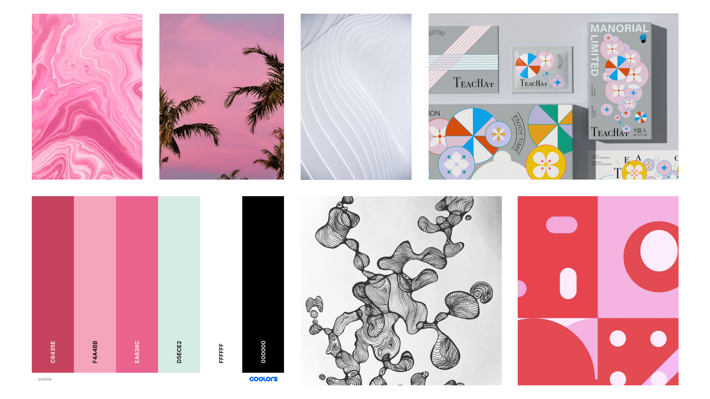

Ensuite, j'ai commencé à imaginer le layout qui pourrait marcher et j'ai fait mes maquettes filaires, puis graphiques.

> Maquette graphique de la page accueil :

> Aperçu Slider de la maquette graphique de la page accueil :

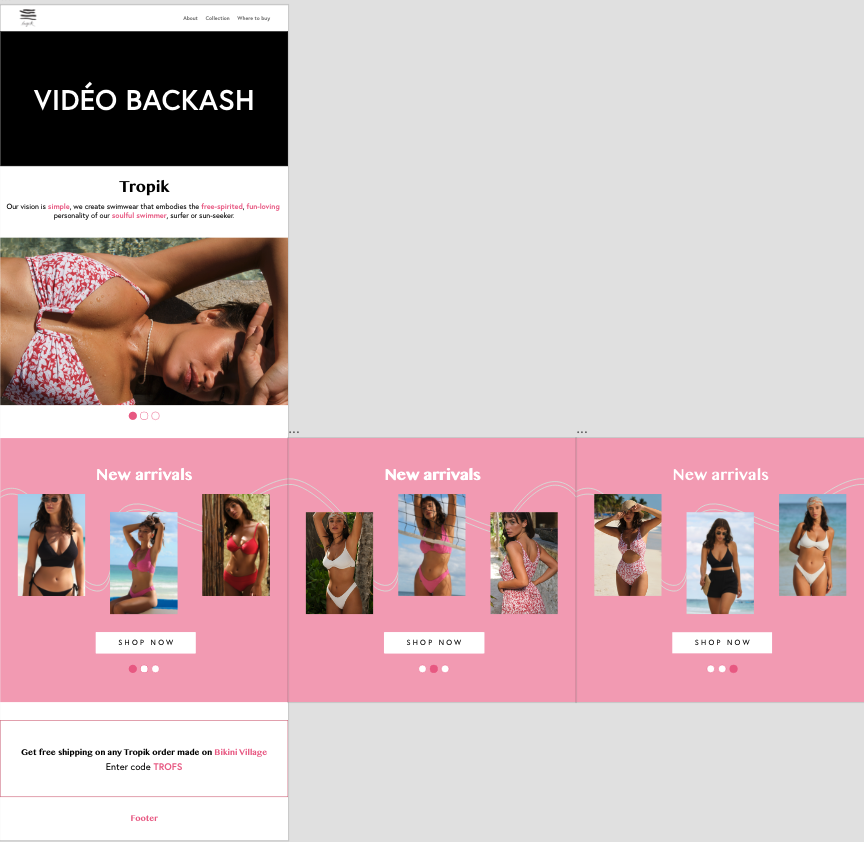

> Maquette graphique de la page à propos :

> Maquette graphique de la page collection :

Ensuite, durant la semaine 3, j'ai eu un meeting dans lequel j'ai dû présenter officiellement mon idée de design à mes superviseurs et dans lequel je devais expliquer mes choix de design. Durant ce meeting, j'ai reçu des commentaires constructifs qui m'ont permis d'avancer.

> Notes du meeting de la semaine 3 :

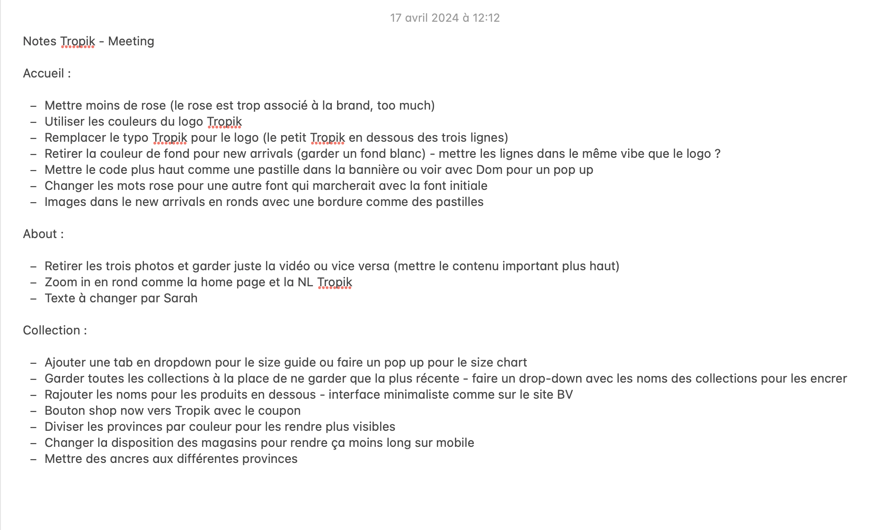

Par la suite, mes idées étaient beaucoup plus claires et je savais quel genre de layout marcherait avec la marque. J'ai donc refait le moodboard avec une nouvelle palette de couleur pour régler la principal critique qui était mentionné durant le meeting; soit la couleur rose. J'ai également changé quelques-unes de mes inspirations pour suivre un mouvement plus **bubbly* pour le design. 

> Nouveau moodboard :

Ensuite, j'ai recommencé les maquettes filaires, puis graphiques pour suivre ma nouvelle idée.

> Home page maquette graphique :

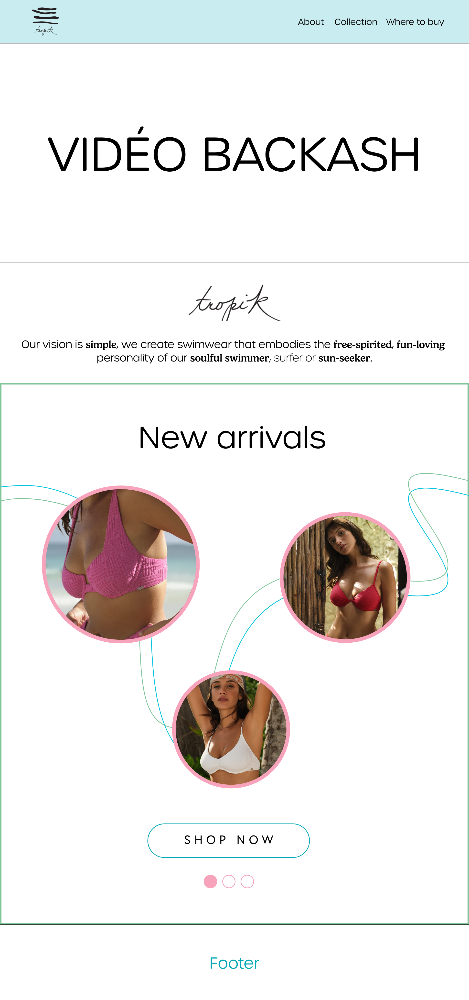

> Slider 01 maquette graphique :

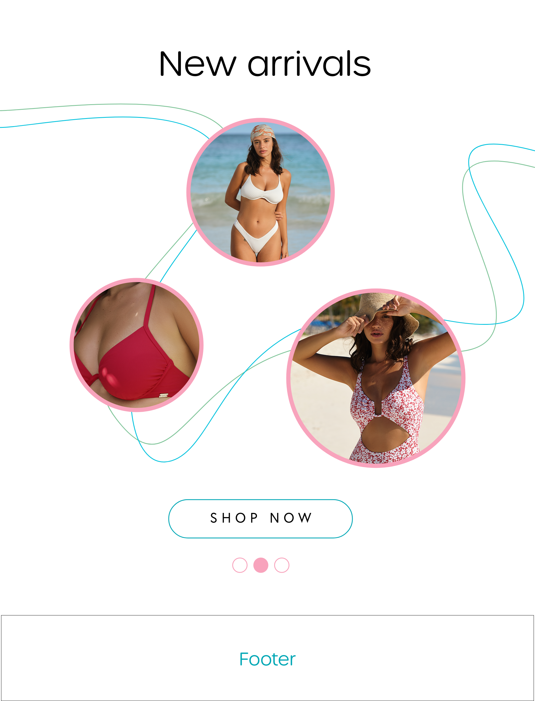

> Slider 02 maquette graphique :

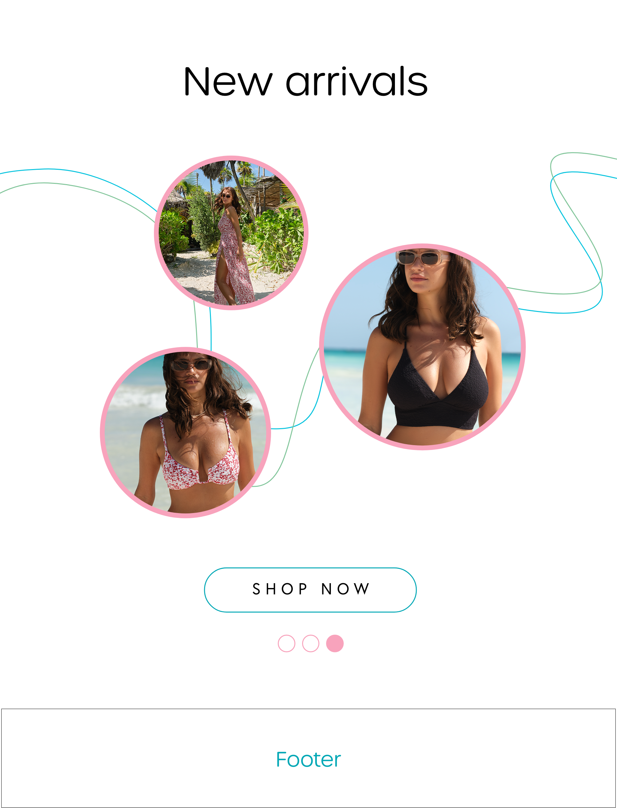

> Pop up maquette graphique :

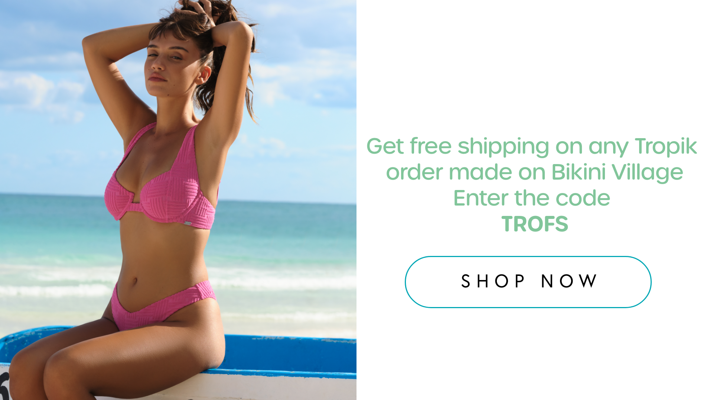

> À propos maquette graphique :

> Collection maquette graphique :

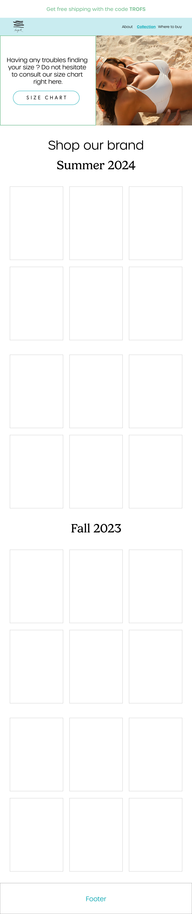

> Where to buy maquette graphique :

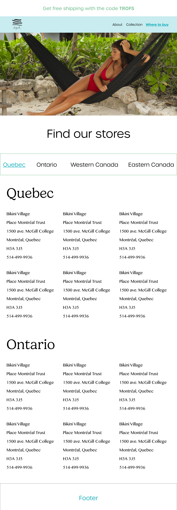

À la semaine 6, j'ai eu mon deuxième meeting pour présenter l'avancement de mon projet. Le meeting s'est super bien passé et les seuls commentaires qui ont été dit étaient des suggestions supplémentaires pour rendre le layout encore plus complet. Mise-à part ça, mes superviseurs étaient très satisfait de mon travail.

> Meeting de la semaine 6 :

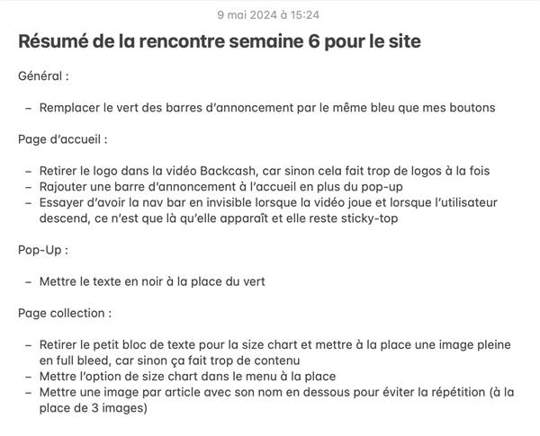

Une fois les petites corrections faites, je commence l'intégration sur SquareSpace. Tout d'abord, je me fais quelques tests pour voir si mon layout sera possible sur la plateforme.

> Premiers tests :

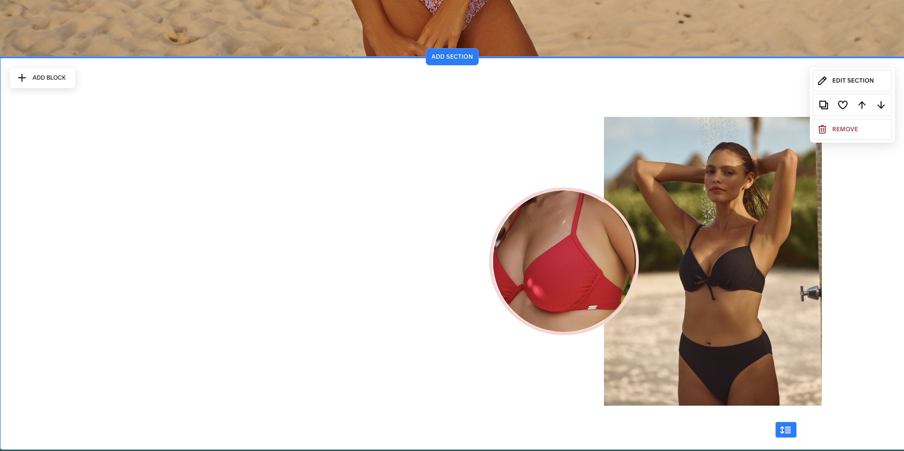

Ensuite, je réalise que certaines sections nécessiteront de la programmation et j'ai dû apprendre par moi-même à programmer sur SquareSpace.

> Premières lignes de code :

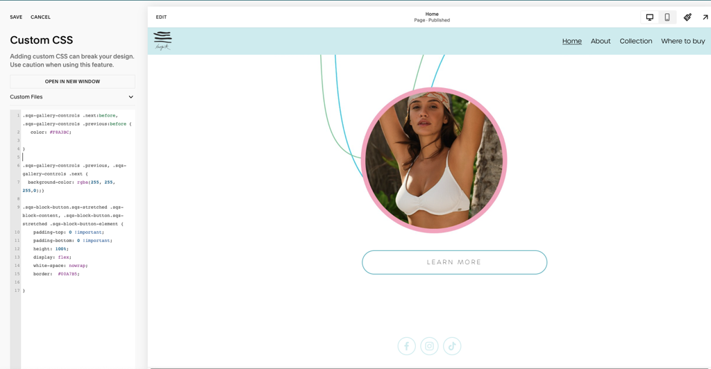

J'ai dû programmer pour modifier des détails tels que l'apparence en survol du menu principal, les boutons, la taille de certaines composantes sur mobile, l'apparence du pop up et plus encore. 

Malgré tout mes efforts, il y a eu un aspect qui était sur ma maquette graphique que je n'ai pas pu intégrer dans le vrai site; la ligne de la page **About**. En effet, la plateforme SquareSpace ne me donnait pas le résultat souhaité et je n'ai pas réussi à programmer un bon résultat. J'ai dû donc improviser un autre layout ressemblant. De plus, l'autre aspect qui était sur ma maquette graphique que je n'ai pas pu intégrer sur le vrai site est la bande des provinces sur la page **Where to buy**. En effet, je n'ai pas réussi à mettre un sytème d'encrage, donc je l'ai retirée.

Voilà le résultat final du site Tropik : https://www.tropikswimwear.com/

## Ce que vous feriez différemment et les défis rencontrés.

Le principal défi que j’ai rencontré est l’intégration dans la compagnie. J’ai commencé en janvier, mais malheureusement j’étais en télétravail à ce moment là. Ce n’est qu’au début du stage que j’ai commencé à venir au bureau plus souvent et je n’étais donc pas habituée à mes collègues en présentiel. Ce que j’aurais fait différemment aurait été de dîner plus souvent avec eux et essayer un peu plus de m’intégrer.

## Ce que vous retenez de votre stage.

Je retiens de ce stage que, grâce a la technique TIM, j’ai pu vraiment devenir polyvalente et ça m’as grandement aidé durant mon stage car je pouvais toucher à tout. Je trouve que je me suis grandement amélioré durant mon stage et que je ne peux que progresser encore plus.
